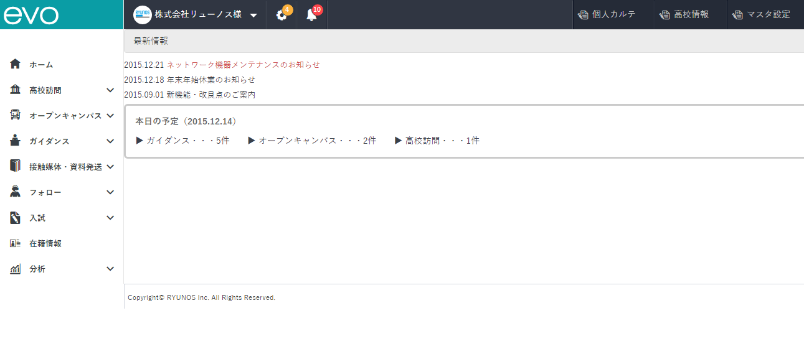
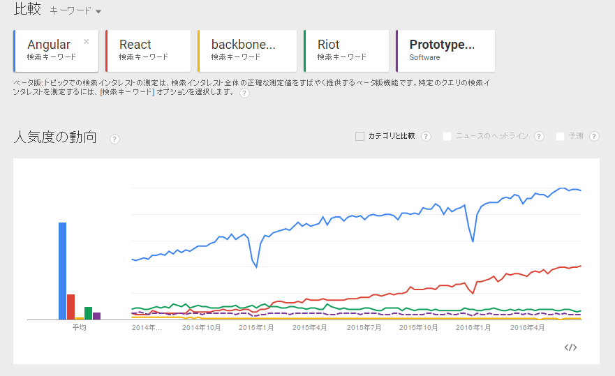
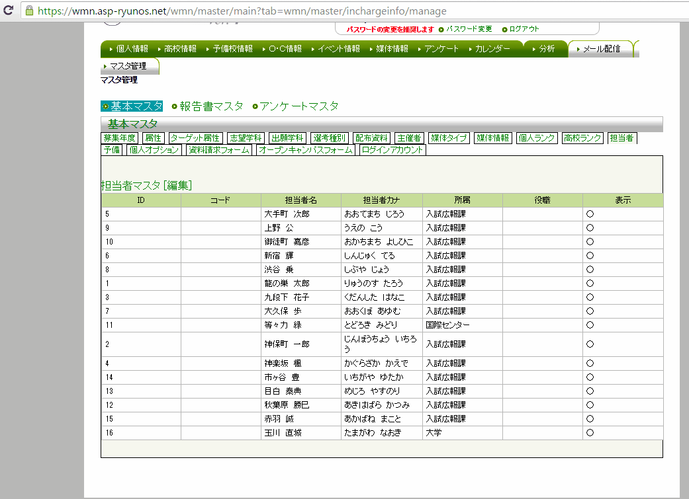
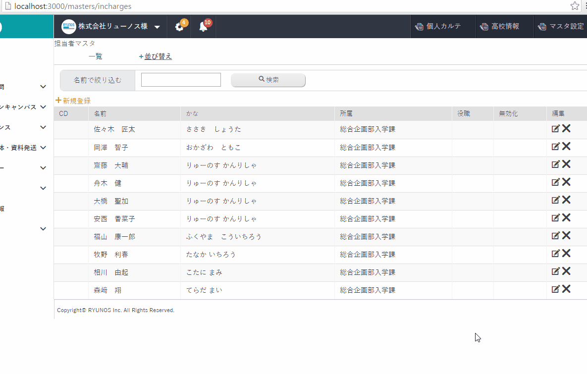

### 3.学校募集支援システムのリニューアル
 

---

### evo
学校募集支援システム Web Matching Navigation4リニューアル版です。 (以下 マッチングナビ)

--

---

### evo?

利用している技術が変わり新しくなりました。

---

### マッチングナビとevoの技術年表(1/3)

HTML

|マッチングナビ|evo|
|:--|:--|
|xhtml 1.0(2000年)|html 5(2014年)|
 

* 動画、音楽再生
* 高い互換性をもつ（スマートフォンや古いPCに配慮）
* 今まで以上の意味のある文章が可能になり、  表示が豊かに

これまで難しかった表現が実現になる

---

### マッチングナビとevoの技術年表(2/3)

CSS

|マッチングナビ|evo|
|:--|:--|
|CSS 2.0(1998年)|CSS 3(2013年)|
 

* アニメーションが可能になり動きのある表現ができる
* 活版印刷と同じ表現が可能になった

見た目が綺麗で美しい表示に実現できる

---

### マッチングナビとevoの技術年表(3/3)

JavaScript

|マッチングナビ|evo|
|:--|:--|
|prototype 1.7(2008年)|Angular 2(2016年)|
 

* リアルタイム性のある表現が実現可能。
* 同期、非同期的処理が自由度の高い
* アップルのWWDC 2016のサイトではAngularが採用

ネイティブアプリと変わらない機能が実現できる

--

### ex. 世界的にAngularが人気

### evo?
#### マッチングナビとevoの技術比較
* リアルタイムかつシームレスに 画面の操作が可能になりました。
  - 読み込みが無くなり速い

---

### DEMO
#### リアルタイム性(1/4)

--

### DEMO
#### リアルタイム性(2/4)
* マッチングナビ

--

### DEMO
#### リアルタイム性(3/4)
* evo

--

### DEMO
#### リアルタイム性(4/4)
* evo

---

## 以上、ご清聴ありがとうございました。

